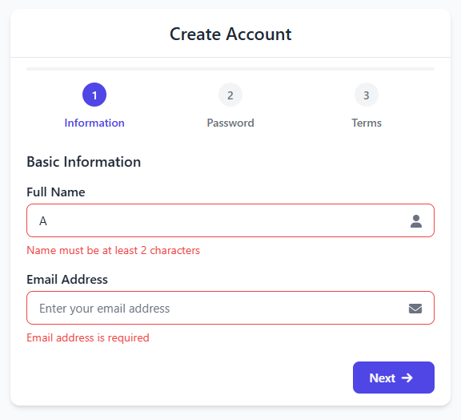
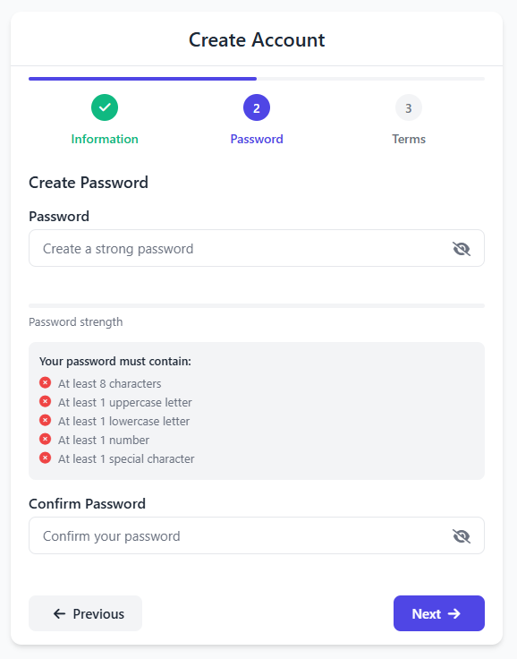
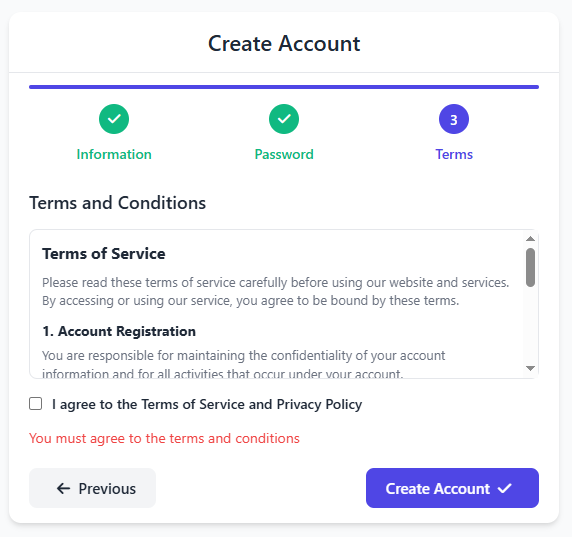

# Multi-Step Signup UI


[](https://github.com/ramazancetinkaya/multi-step-signup/issues)
[](https://github.com/ramazancetinkaya/multi-step-signup/stargazers)
[](https://github.com/ramazancetinkaya/multi-step-signup/network)


A production-ready multi-step registration system built with pure HTML, CSS, and JavaScript.

## Copyright Disclaimer and Usage Conditions

This project is released under conditional usage terms. By liking and forking this repository, you are granted permission to use, modify, and integrate both the frontend and backend components into official projects without copyright restrictions. You may adapt and customize the codebase as needed for your implementation requirements.

If these conditions are not met, this software may only be used for educational and testing purposes. Commercial or production use without meeting the specified conditions is not permitted.

## Overview

This project implements a professional signup flow that guides users through a streamlined registration process. Built with performance and user experience in mind, it delivers a polished registration experience without any framework dependencies.

## Features

### User Experience

- **Intuitive Step-by-Step Flow**
  - Progressive disclosure of form fields reduces cognitive load
  - Visual progress indicator helps users track completion
  - Clear navigation between steps with previous/next controls
  
- **Real-time Validation**
  - Immediate feedback as users type
  - Clear error messages with visual indicators
  - Prevents progression until current step is valid

- **Password Security**
  - Visual strength meter with color-coded feedback
  - Interactive requirements checklist
  - Toggle password visibility option

### Technical Implementation

- **Responsive Design**
  - Adapts seamlessly to desktop, tablet, and mobile viewports
  - Optimized for various screen heights to eliminate scrolling
  - Touch-friendly on mobile devices

- **Accessibility**
  - Keyboard navigation support
  - Proper ARIA attributes and semantic HTML
  - Focus management between steps

- **Performance Optimized**
  - Vanilla JS with no dependencies
  - Minimal DOM manipulations
  - Efficient CSS with optimized selectors

## Screenshots

<div align="center">
  
  <p><em>Step 1</em></p>
</div>

<div align="center">
  
  <p><em>Step 2</em></p>
</div>

<div align="center">
  
  <p><em>Step 3</em></p>
</div>

## Demo

Experience the application instantly via GitHub Pages:

[](https://ramazancetinkaya.github.io/multi-step-signup/)

## Technology Stack

- HTML5
- CSS3
- Vanilla JavaScript
- Font Awesome for icons
- No external libraries or frameworks

## Installation

### Option 1: Git Clone

If you have Git installed, use the following command to clone the repository:

```bash
git clone https://github.com/ramazancetinkaya/multi-step-signup.git
```

Navigate to the project directory:

```bash
cd multi-step-signup
```

Open `index.html` in your web browser to use the application.

### Option 2: ZIP Download

1. Visit the repository at `https://github.com/ramazancetinkaya/multi-step-signup`
2. Click the "Code" button
3. Select "Download ZIP" from the dropdown menu
4. Extract the ZIP file to your preferred location
5. Open the extracted folder
6. Open `index.html` in your web browser to use the application

## Usage

Simply open the `index.html` file in any modern web browser to start using the application. No server or additional dependencies are required.

## Browser Compatibility

Tested and working on:
- Chrome (latest)
- Firefox (latest)
- Safari (latest)
- Edge (latest)
- Opera (latest)
- Mobile browsers (iOS Safari, Android Chrome)

## Contributing

Contributions are welcome! Please feel free to submit a pull request or open an issue for any enhancements or bug fixes.

## License

This project is licensed under the MIT License. See the [LICENSE](LICENSE) file for more details.

## Author

Designed and developed by **Ramazan Çetinkaya**.

## Contact

For any inquiries, please contact:

- GitHub: [ramazancetinkaya](https://github.com/ramazancetinkaya)
- Email: [ramazancetinkayasoftworks@protonmail.com](mailto:ramazancetinkayasoftworks@protonmail.com)
